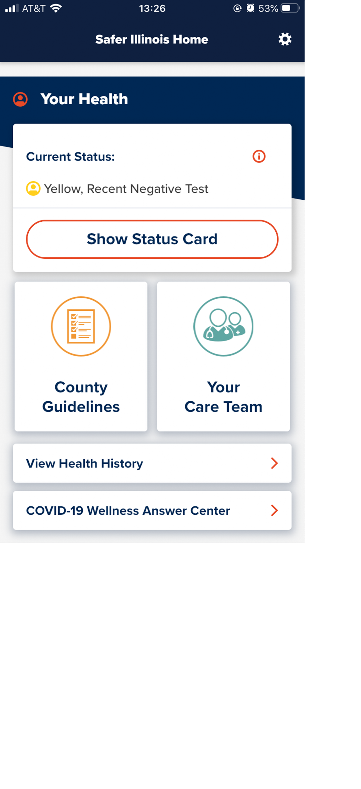

<!--  -->

__SAFER ILLINOIS__

USER GUIDE

Version 1\.0\.2

April 2021

 __COPYRIGHT__ 

__User Guide Credits__

Writers: Rebecca Avgoustopoulos and Isaac Galvan

Design: Chia\-Ching Wu

__Publication History__

2020\, Dec v1\.0\.0; 2021\, Jan v1\.0\.1

2021\, April v1\.0\.2

__Copyright__

Copyright © 2021 University of Illinois Board of Trustees

[CC\-BY\-SA 4\.0](https://creativecommons.org/licenses/by-sa/4.0/legalcode)This work is licensed under a

Creative Commons Attribution Share Alike 4\.0 International license

__Software Credits__

The Safer Illinois app was developed for the University of Illinois by the Smart\, Healthy Communities Initiative\, Technology Services\, NCSA\, and Grainger College of Engineering Department of Electrical & Computer Engineering\.

Safer Illinois is open\-source software published under an [Apache\-2\.0](https://opensource.org/licenses/Apache-2.0) license\.

Lead Developers: John Paul and Sanjay Patel

[Other Contributors](https://safer.illinois.edu/about.html)

SaferIllinois User Guide

 __ABOUT SAFER ILLINOIS__ 

The University of Illinois developed the Safer Illinois application to support the health and safety of the community\. It provides resources to monitor personal health and limit exposure to slow down the spread of COVID\-19\.

Safer Community is a similar application made explicitly for use by community members outside the University of Illinois to provide access to the [University of Illinois COVID\-19 SHIELD test](https://shieldcu.illinois.edu/#illinois-test) \.

If you are a student or employee of the University of Illinois\, you should use Safer Illinois\.

If you are not a university student or employee\, you should use Safer Community\.

Safer Illinois and Safer Community are both compatible with Apple and Android mobile devices\.

Safer Illinois User Guide

 __YOU CAN USE THIS APP TO__ 

Get confidential COVID\-19 test results\.

Show building access status\.

Self\-report COVID\-19 symptoms\.

Get COVID\-19 exposure notifications\.

_University of Illinois participants \(student\, faculty\, staff\, or affiliate\): Use your NetID_  _and password to verify your account and sign in\._

_Non\-University participants \(family and household members of Illinois students\, faculty\, staff\, or affiliates\): Sign up for an account in the Safer Community app to enroll and participate_  _in the testing program\._

Safer Illinois User Guide

* __Getting Started__
  * [Getting the App](slide8.xml)  [8](slide8.xml)
  * [Need a Smartphone?](slide8.xml)  [8](slide8.xml)
  * [Getting Started                                  9](slide9.xml)
  * [Setting Up Messaging                             10](slide10.xml)
  * [Setting Up Account](slide14.xml)  [14](slide14.xml)
  * [Consenting to Participate](slide18.xml)  [18](slide18.xml)

__Home Screen__

[Home Screen Overview                               23](slide23.xml)

__Settings Screen__

[Settings Screen Overview                            26](slide26.xml)

* __Signing In and Signing Out__
* [Signing In to the App](slide30.xml)  [30](slide30.xml)
  * [Signing Out of the App                               33](slide33.xml)

* __Managing Your Health__
*  _[Accessing Campus Buildings                       36](slide36.xml)_ 
  *  _[Contacting Your Healthcare Team               40](slide40.xml)_ 
  *  _[Finding Test Locations                                 42](slide42.xml)_ 

* __Navigating the Testing Process__
*  _[Before Getting Tested                                 45](slide45.xml)_ 
  *  _[Getting Tested                                             4](slide46.xml)_    _6_ 
  *  _[Viewing Test Results                                    48](slide48.xml)_ 
  *  _[Adding New Test Results                             50](slide50.xml)_ 

Safer Illinois User Guide

* __Maintenance__
*  _[Saving Your COVID\-19 QR Code](slide53.xml)_    _[53](slide53.xml)_ 
  *  _[Transferring to a New Device](slide56.xml)_    _[56](slide56.xml)_ 
  *  _[Retrieving Your Last Test Result                  58](slide58.xml)_ 
  * [Removing Your Information                        60](slide60.xml)
  * [Sponsoring a Family/Household Member   62](slide62.xml)

__Getting Help__

[Online Help                                63](slide68.xml)

[User Support                                              64](slide69.xml)

Safer Illinois User Guide

Safer Illinois User Guide

__[Contents](slide5.xml)__  __>__  __[Getting Started](slide7.xml)__

 __GETTING THE APP__ 

Safer Illinois is compatible with mobile devices running Android and iOS\. Find it in the Apple App Store or Google Play Store\.

Be sure to read the [Privacy Notice](https://www.uillinois.edu/about/policies/mobile/SaferIllinois) before using the app\.

 __NEED A SMARTPHONE?__ 

If you are a faculty\, staff or student at University of Illinois and you don’t own a smartphonecompatible with the Safer Illinois app\, you may be able to borrow one from the university\. Find out about technology loan programs on the [Faculty\, Staff\, and Student Technology Equipment Needs](https://techservices.illinois.edu/content/faculty-staff-and-student-technology-equipment-needs) page and contact them now\.

Safer Illinois User Guide

__[Contents](slide5.xml)__  __>__  __[Getting Started](slide7.xml)__

 __GETTING STARTED__ 

Tap __Get Started__ to begin setup\.

Safer Illinois User Guide

__[Contents](slide5.xml)__  __>__  __[Getting Started](slide7.xml)__  __>__  __[Setting Up Messaging](slide10.xml)__

 __SETTING UP MESSAGING__ 

Safer Illinois uses the Exposure Notification system to informyou ofpossible contact withotherusers whohave testedpositive for COVID\-19\. The system traces proximityto other enabled phones anonymouslyusing Bluetooth\.

You must enable __notifications\, location services\,__ and __Bluetooth__ on both the application settings and on your device settings toreceive all messagesinthe app\.

These settings can be adjusted in the app __Settings__ after initial setup\.

_For more information visit_   _[Exposure Notifications](https://answers.uillinois.edu/illinois/104692)_   _\._

Safer Illinois User Guide

__[Contents](slide5.xml)__  __>__  __[Getting Started](slide7.xml)__  __>__  __[Setting Up Messaging](slide10.xml)__

__Enabling Notifications__

Tap __Enable Notification__ to enable notifications\.

Thissetting allows you to receive important messages from the app\.

_Learn more about_   _[Exposure Notifications](https://answers.uillinois.edu/illinois/104692)_  \.

Safer Illinois User Guide

__[Contents](slide5.xml)__  __>__  __[Getting Started](slide7.xml)__  __>__  __[Setting Up Messaging](slide10.xml)__

__Enabling Location Services__

\(On Android systems\)

Location services must be turned on to activate the Exposure Notificationsystem\.Even if you turn on location services\, the app does not access your location\, or collect or store any location data\.

Safer Illinois User Guide

__[Contents](slide5.xml)__  __>__  __[Getting Started](slide7.xml)__  __>__  __[Setting Up Messaging](slide10.xml)__

__Enabling Bluetooth__

Bluetooth must be turned on to activate the Exposure Notification system\. This setting allows the app to track possible COVID\-19 exposures\.

Safer Illinois User Guide

 __[Contents](slide5.xml)__    __>__    __[Getting Started](slide7.xml)__    __>__    __[Setting Up Account](slide14.xml)__ 

 __SETTING UP ACCOUNT__ 

University affiliates will set up their accounts using their NetID\.

Non\-University participants will use their cell phone number\. They must be registered on the SHIELD CU testing roster to receive their COVID\-19 test results through Safer Illinois\.

Safer Illinois User Guide

__[Contents](slide5.xml)__  __>__  __[Getting Started](slide7.xml)__  __>__  __[Setting Up Account](slide14.xml)__

__Selecting Your Affiliation__

__University Student__ – Undergraduate or graduate student\. Sign in withNetID\.

__University Employee__ –Faculty or staff\. Sign in with NetID\.

__University Affiliate__ – Other connection to the University with digital access privileges\. Sign in with NetID\.

__Non\-University Member__ – Community member in the SHIELD CU COVID\-19 testing program\. Sign in with phone number\.

Safer Illinois User Guide

__[Contents](slide5.xml)__  __>__  __[Getting Started](slide7.xml)__  __>__  __[Setting Up Account](slide14.xml)__

__University Affiliate__

Tap __Log in with NetID__  __to__ proceed to the University of Illinois single sign\-on page\.

Safer Illinois User Guide

__[Contents](slide5.xml)__  __>__  __[Getting Started](slide7.xml)__  __>__  __[Setting Up Account](slide14.xml)__

__Non\-University Member__

Your phone number will serve as your sign\-in credentials\.

Safer Illinois User Guide

__[Contents](slide5.xml)__  __>__  __[Getting Started](slide7.xml)__

 __CONSENTING TO PARTICIPATE__ 

Now that you have enabled messaging and set up your account\, you can give your consent to receive health information\.

Your COVID\-19 test results cannot besentautomatically to your mobile device without your consent\. _You may also withdraw your consent at any time_ \.

Safer Illinois User Guide

__[Contents](slide5.xml)__  __>__  __[Getting Started](slide7.xml)__

__CONSENTING TO PARTICIPATE__

Tap the switches to consent to:

Participating in the Safer Illinois Exposure Notification system\.

Receiving Automatic Test Results from your healthcare provider\.

_Learn more about_   _[Exposure Notifications](https://answers.uillinois.edu/illinois/104692)_   _\._

Safer Illinois User Guide

__[Contents](slide5.xml)__  __>__  __[Getting Started](slide7.xml)__

__SAVING YOUR ENCRYPTION KEY__

Save your encryption key so that you can retrieve your health history information later\.

_For more information see_   _[Saving your COVID\-19 Private Key QR code](slide53.xml)_   _in the_  _Maintenance_  _section_  _\._

Safer Illinois User Guide

__[Contents](slide5.xml)__  __>__  __[Getting Started](slide7.xml)__

__YOU CAN NOW USE THE APP__

Tap __Get Started__ to go to the Safer Illinois Home Screen\.

Safer Illinois User Guide

[Home Screen](slide23.xml)

[Settings Screen](slide26.xml)

[Signing In and Signing Out](slide29.xml)

[Managing Your Health](slide35.xml)

[Navigating the Testing Process](slide44.xml)

[Maintenance](slide52.xml)

[Getting Help](slide67.xml)

Safer Illinois User Guide

Safer Illinois User Guide

__[Contents](slide5.xml)__  __>__  __[Home Screen](slide23.xml)__

__HOME SCREEN OVERVIEW__

Accumulated test results\, exposure history\, and symptom reports\.

View the next steps you should take here\.

Find test sites\, schedules\, and wait times\.

Find out if you need to get tested\.

Retrieve test results from your healthcare provider\.

Safer Illinois User Guide

__[Contents](slide5.xml)__  __>__  __[Home Screen](slide23.xml)__

__HOME SCREEN OVERVIEW__

__Continued__

Building Access Pass and ID Code to scan at test sites\.

Get help with your COVID\-19 questions and technical support\.

Safer Illinois User Guide

Tap __Settings__ \(⚙\) in the upper right\-hand corner of the home screen to open the __Settings screen__ \.

Safer Illinois User Guide

__[Contents](slide5.xml)__  __>__  __[Settings Screen](slide26.xml)__

__SETTINGS SCREEN OVERVIEW__

Set user affiliation\.

[Sign out of the app\.](slide33.xml)

Allow app to sendnotifications\.

Safer Illinois User Guide

__[Contents](slide5.xml)__  __>__  __[Settings Screen](slide26.xml)__

__SETTINGS SCREEN OVERVIEW__

__Continued__

Enable Exposure Notificationsystem\.

Enableautomatic receipt of test results\.

[Secret QR Code](slide53.xml) for backup of your stored information\.

Policies and terms of service\.

View or [remove your information\.](slide60.xml)

Consent your family members for joining testing group\.

Installed version of Safer Illinois\.

Safer Illinois User Guide

 __Signing In and__    __Signing Out__ 

Safer Illinois User Guide

__[Contents](slide5.xml)__  __>__  __[Signing In and Signing Out](slide29.xml)__

 __SIGNING IN__    __TO__    __THE APP__ 

If you are not already signed in with your NetID or phone number\, this procedure shows you how\.

You will need to be signed in to the app to receive test results and gain access to buildings\. You can sign in and out of the app any time if you need to switch users\.

Safer Illinois User Guide

__[Contents](slide5.xml)__  __>__  __[Signing In and Signing Out](slide29.xml)__

__SIGNING IN TO THE APP__  __Continued__

Tap Settings \(⚙\) in the upper right\-hand corner of the home screen\.

Tap __Connect your NetID__ \. You will proceed to the University of Illinois Single Sign\-On page\.

Or tap __Verify Your Phone Number__ if you are not a university member\.

Safer Illinois User Guide

__[Contents](slide5.xml)__  __>__  __[Signing In and Signing Out](slide29.xml)__

__SIGNING IN TO THE APP__  __Continued__

__University Members__

Type in your __NetID and Password__ \. Tap Login to confirm your credentials\.

__Non\-University Members__

Type in your __Phone number__ \. Tap Next to confirm\.

Safer Illinois User Guide

__[Contents](slide5.xml)__  __>__  __[Signing In and Signing Out](slide29.xml)__

 __SIGNING OUT__    __OF THE__    __APP__ 

You may sign out of the app by disconnecting your NetID or your phone number\.

Disconnecting will allow other users to sign in to the app from your device using their own NetID or phone number\. Users must have their QR code available for scanning to retrieve their health history and building access on another device\. See [Transferring to a New Device](slide56.xml) \.

This action will not delete information stored about you from the device or the cloud\. To delete your information\, see  __[Remove Your Information](slide60.xml)__  \.

Safer Illinois User Guide

__[Contents](slide5.xml)__  __>__  __[Signing In and Signing Out](slide29.xml)__

Tap Settings \(⚙\) in the upper right\-hand corner of the home screen\.

Tap __Disconnect your NetID__ \.Or __Disconnect your Phone__ for Non\-University members\.

Tap __Yes__ to sign out\. You will return to the home screen and Health Status will no longer be displayed\.

_Note: You must be signed in to access campus facilities or buildings\._

Safer Illinois User Guide

 __Managing YOUR HEALTH__ 

Safer Illinois User Guide

__[Contents](slide5.xml)__  __>__  __[Managing Your Health](slide35.xml)__  __>__  __[Accessing Campus Buildings](slide36.xml)__

 __ACCESSING__ 

 __CAMPUS BUILDINGS__ 

You must show the building access Status Card to enter campus buildings\. Test status is updated when you receive COVID\-19 test results\. To gain access to campus buildings\, you must maintain Yellow COVID\-19 status\.

Required test frequency is determined by CUPHD based on local COVID\-19 transmission rates\.

Safer Illinois User Guide

__[Contents](slide5.xml)__  __>__  __[Managing Your Health](slide35.xml)__  __>__  __[Accessing Campus Buildings](slide36.xml)__

__ACCESSING CAMPUS__  __BUILDINGS__

* Tap __Show Status Card__ on the Safer Illinois home screen\. Your building access status depends on your recent test results\.
  * __GRANTED__ – You have access to campus buildings\.
  * __DENIED__ – You do not have access to campus buildings\.

Safer Illinois User Guide

__[Contents](slide5.xml)__  __>__  __[Managing Your Health](slide35.xml)__  __>__  __[Accessing Campus Buildings](slide36.xml)__

__ACCESSING CAMPUS__  __BUILDINGS__

__Continued__

Swipe left to reveal your __COVID\-19 test results__ and __ID QR Code__ \.

The ID QR code is the same as youri\-card\. It can be scanned at any test center\.

Safer Illinois User Guide

__[Contents](slide5.xml)__  __>__  __[Managing Your Health](slide35.xml)__  __>__  __[Accessing Campus Buildings](slide36.xml)__

__DECODING STATUS__  __COLORS__

* Tap ⓘ to view the COVID\-19 status color codes\.
  * Yellow: Negative COVID\-19 test
  * Orange: Visit a Test Center soon
  * Red: Positive COVID\-19 test

Safer Illinois User Guide

__[Contents](slide5.xml)__  __>__  __[Managing Your Health](slide35.xml)__

 __CONTACTING YOUR__ 

 __HEALTHCARE TEAM__ 

Reach out to your healthcare team when you have received a positive test result or if you have symptoms consistent with COVID\-19\. You can discuss your symptoms with a nurse over the phone or schedule an appointment for clinical care\.

Safer Illinois User Guide

__[Contents](slide5.xml)__  __>__  __[Managing Your Health](slide35.xml)__

__CONTACTING YOUR HEALTHCARE TEAM__

Scroll down to __Your Health__ on the Safer Illinois home screen\.

Tap __Your Care Team__ \.

Tap __Call McKinley Health__ or __OSF__  __OnCall__ to get in touch with a nurse

Safer Illinois User Guide

__[Contents](slide5.xml)__  __>__  __[Managing Your Health](slide35.xml)__  __>__  __[Finding Test Locations](slide42.xml)__

 __FINDING TEST LOCATIONS__ 

Test centers at many convenient locations across campus are open at most normal business hours\. You can find a nearby test center\, view its projected wait time\, and confirm hours of availability before you even leave your home\.

Safer Illinois User Guide

__[Contents](slide5.xml)__  __>__  __[Managing Your Health](slide35.xml)__  __>__  __[Finding Test Locations](slide42.xml)__

__VIEWING AVAILABLE TEST CENTERS__

Tap the test center address to view its location on a map\.

Tap the   __down arrow__   on a test center’s hours to view its full weekly hours of availability\. ​

Tap __Find Test Locations__ on the Safer Illinois home screen\.

Scroll down to view a complete list of available test centers\.

Safer Illinois User Guide

 __Navigating THE TESTING PROCESS__ 

Safer Illinois User Guide

__[Contents](slide5.xml)__  __>__  __[Navigating the Testing Process](slide44.xml)__

 __BEFORE GETTING TESTED__ 

__For University Members__

All university faculty\, staff and students participating in any on\-campus activities are required to participate in the on\-campus COVID\-19 testing program\. Follow the required testing schedule\. You can test on campus if you have an active NetID and ani\-card\.

Visit the  _[On\-Campus COVID\-19 Testing](https://covid19.illinois.edu/health-and-support/on-campus-covid-19-testing/)_  website for more information\.

__For Everyone__

Avoid eating\, drinking\, brushing your teeth\, chewing gum\, or using tobacco for at least one hours before testing\.

Bring your currenti\-card OR use the [Status Card QR Code](slide38.xml) for identification\.

Wear a mask and keep a safe distance from other people in line\.

Safer Illinois User Guide

__[Contents](slide5.xml)__  __>__  __[Navigating the Testing Process](slide44.xml)__

*  __GETTING TESTED__ 
* Illinois on\-campus testing sites administer saliva\-based COVID\-19 PCR tests\, which are non\-invasive and quick to analyze\. Test locations are conveniently available all across campus\. _See Also:_   _[Find Test Locations](slide42.xml)_   _\._
* __Registration__
* Approach the next available testing associate when you are called\. You will be asked some questions\.
  * Have you had anything to eat\, drink\, smoke\, or chew in the last 60 minutes?
* Swipe youri\-card or show your ID QR Code on your Status Card in the Safer Illinois app\. You will be asked some more questions:
  * What is your name and birth date?
  * Is the mobile phone number listed still accurate?
  * Is the address listed still accurate?
  * Do you identify as Hispanic/Latino? \(You may say: “I would prefer not to answer this question\.”\)
  * What race do you most identify with?\(You may say: “I would prefer not to answer this question\.”\)

Safer Illinois User Guide

__[Contents](slide5.xml)__  __>__  __[Navigating the Testing Process](slide44.xml)__

 __GETTING TESTED__ 

__Giving Your Sample__

Verify that your name is correct on the test tube label\.

Move to the next available station\.

Take the lid off the test tube\.

Dribble saliva into the tube to the required amount\.

Replace the lid and take the tube to the collection station\.

Take your test tube to the collection station\.

Take a copy of the __COVID\-19 Test Fact Sheet for Patients\.__

_Note: An online copy of the_   _[COVID\-19 Test Fact Sheet](https://covid19.illinois.edu/wp-content/uploads/2020/09/COVID-19_FACT_SHEET_FOR_PATIENTS_24SEPT-2020.pdf)_   _is also available in PDF format\._

Safer Illinois User Guide

__[Contents](slide5.xml)__  __>__  __[Navigating the Testing Process](slide44.xml)__

 __VIEWING TEST RESULTS__ 

You can expect most COVID\-19 test results to be available within five hours of visiting a test center\, but results could take up to 48 hours\. If you are a university member\, you can view your results on the [McKinley Health Center Patient Portal](https://mymckinley.illinois.edu/)  [\.](https://mymckinley.illinois.edu/) They will also be delivered to the Safer Illinois app\.

Non\-University members can receive their results only on the app\.

Safer Illinois User Guide

__[Contents](slide5.xml)__  __>__  __[Navigating the Testing Process](slide44.xml)__

__VIEWING TEST RESULTS__

Tap __View Health History__ in the Home screen\.

Tap __More Info__ to view the result of a particular test\.

_Note: If you are a new user of the Safer Illinois app or you have recently reinstalled the app\, only your most recent on\-campus test result will be visible in your Health History\._

Safer Illinois User Guide

Safer Illinois User Guide

__[Contents](slide5.xml)__  __>__  __[Navigating the Testing Process](slide44.xml)__

 __ADDING NEW TEST RESULTS__ 

Test results that you receive automatically from McKinley Health Center are already verified\. Your health status in the app is updated upon receipt\.

Test results that you enter manually must be reviewed by a public healthcare provider\. Your health status will update once these results are verified\.

Safer Illinois User Guide

__[Contents](slide5.xml)__  __>__  __[Navigating the Testing Process](slide44.xml)__

__ADDING NEW TEST RESULTS__

Tap __Add Test Result__ in the Safer Illinois home screen\.

Select your Healthcare Provider from the drop menu\.

_Note: Currently\, you can select only McKinley Health Center or OSF Health Care\._

Tap __Retrieve Results__ to sign in to the OSF Health Care patient portal\.

Enter your __OSF MyChart__ username and password and tap __Sign In__ \.

Safer Illinois User Guide

Safer Illinois User Guide

__[Contents](slide5.xml)__  __>__  __[Maintenance](slide52.xml)__  __>__  __[Saving COVID\-19 Private Key QR Code](slide53.xml)__

 __SAVING YOUR COVID\-19__ 

 __PRIVATE KEY QR CODE__ 

The __COVID\-19__ Private Key is an encrypted key that protects your data in Safer Illinois\. Your mobile device uses this code to receive your confidential test results and log your reported symptoms\. You must use a unique QR code associated with your Private Key to transfer your information to a new or replacement mobile device\. Do not share the QR code with others\, as it unlocks your private information\.

_Learn more_   _about_    _[Encryption Keys and Secret QR Code](https://answers.uillinois.edu/illinois/103844)_   _\._

Safer Illinois User Guide

__[Contents](slide5.xml)__  __>__  __[Maintenance](slide52.xml)__  __>__  __[Saving COVID\-19 Private Key QR Code](slide53.xml)__

__SAVING YOUR__

__COVID\-19 PRIVATE KEY QR CODE__

Tap Settings \(⚙\) in the upper right\-hand corner of the home screen\.

Tap __QR Code__ \. This button is located under the COVID\-19 section\.

Safer Illinois User Guide

__[Contents](slide5.xml)__  __>__  __[Maintenance](slide52.xml)__  __>__  __[Saving COVID\-19 Private Key QR Code](slide53.xml)__

__SAVING YOUR__

__COVID\-19 PRIVATE KEY QR CODE__

Tap __Save__ \. Your mobile device will save the QR Code as a photo to your gallery\.

_Note: You can also take a screenshot of the QR Code and save it yourself\._

Safer Illinois User Guide

__[Contents](slide5.xml)__  __>__  __[Maintenance](slide52.xml)__  __>__  __[Transferring to a New Device](slide56.xml)__

 __TRANSFERRING TO__ 

 __A NEW DEVICE__ 

When you download Safer Illinois to a new device or reinstall the app on your current device\, you will need to scan your COVID\-19 Private Key QR Code to retrieve your Health Status\, recent test results\, and symptoms history\. Have a photo of your QR code ready to scan when setting up the app\.

_Learn more about_   _[Encryption Keys and Secret QR Code](https://answers.uillinois.edu/illinois/103844)_   _\._

Safer Illinois User Guide

__[Contents](slide5.xml)__  __>__  __[Maintenance](slide52.xml)__  __>__  __[Transferring to a New Device](slide56.xml)__

__RESTORING YOUR SAVED DATA__

To transfer your user data to a new device\, go to the Missing COVID\-19 private key section in Settings\.

Tap __Scan__ to read the QR code from your other device or photo gallery\.

Or\, tap __Load__ to read in the QR code from a file on the current device\.

_Safer Illinois will upload your most recent Test Results\, Health Status\, and Building Access to the new mobile device\._

Tap __Reset__ to create a new QR code\.

Safer Illinois User Guide

__[Contents](slide5.xml)__  __>__  __[Maintenance](slide52.xml)__  __>__  __[Retrieving Last Test Result](slide58.xml)__

 __RETRIEVING YOUR__ 

 __LAST TEST RESULT__ 

When you download Safer Illinois to a new device or reinstall the app on your current device\, you will retrieve your test history using the Private Key QR Code\. However\, if you have lost your Private Key QR Code\, you will need to retrieve your last test result from McKinley Health Center in order to reinstate your building access\.

Safer Illinois User Guide

__[Contents](slide5.xml)__  __>__  __[Maintenance](slide52.xml)__  __>__  __[Retrieving Last Test Result](slide58.xml)__

__RETRIEVING YOUR__

__LAST TEST RESULT__

Tap __Request My Latest Test Again__ to retrieve your most recent test result after reconnecting your NetID or reinstalling the app\.

_Note: Your NetID must be connected and you must be running the latest version of Safer Illinois to receive test results\._

Safer Illinois User Guide

__[Contents](slide5.xml)__  __>__  __[Maintenance](slide52.xml)__  __>__  __[Removing Information](slide60.xml)__

 __REMOVING YOUR INFORMATION__ 

Safer Illinois stores some of your personal information on your device and on secure servers to keep track of your health status and keep your app preferences up to date\. You may opt out of information collection and request that your Personally Identifiable Information \(PII\) be permanently deleted at any time\.

 _For more information\, visit the_    _[Privacy Notice](https://www.uillinois.edu/about/policies/mobile/SaferIllinois)_    _\._ 

Safer Illinois User Guide

__[Contents](slide5.xml)__  __>__  __[Maintenance](slide52.xml)__  __>__  __[Removing Information](slide60.xml)__

__REMOVING YOUR INFORMATION__

Tap Settings \(⚙\) in the upper right\-hand corner of the home screen\.

Tap __Personal Info__ \. This button is found under the __Your Account__ sectionof __Settings__  __\.__

Tap __Remove My Information__ \.

Read the disclaimer and tap __Yes__ to confirm

_Once you remove your information\, you will be signed out\. Your health status and building access will no longer be displayed\, and your app preferences will be deleted\. Removing your information is permanent\._

Safer Illinois User Guide

__[Contents](slide5.xml)__  __>__  __[Maintenance](slide52.xml)__  __>__  __[Sponsoring a Family or Household Member te](slide62.xml)__

<!--   -->
__SPONSORING A FAMILY OR HOUSEHOLD MEMBER test__ 
<!--  -->

Students\, faculty\, and staff of the University of Illinois may sponsor their family or household member in the COVID\-19 testing program\.  The sponsor's account will be billed for each COVID\-19 test\.

SaferIllinois User Guide

__[Contents](slide5.xml)__  __>__  __[Maintenance](slide52.xml)__  __>__  __[Sponsoring a Family or Household Member](slide62.xml)__

__SPONSORING A FAMILY OR HOUSEHOLD MEMBER__

When a family or household member enrolls in the testing program through Safer Community\, sponsors will receive a request in Safer Illinois\.

__I Approve__ will enroll the Safer Community user in the testing program and add them to the __Family Members__ section in the __Settings__ \.

__I Disapprove__ will deny the user's request for permission to enroll\. _Note: Only approve requests from users that you recognize\._

Safer Illinois version 2\.9\.21 or later is required to receive permission requests from Safer Community\.

SaferIllinois User Guide

__[Contents](slide5.xml)__  __>__  __[Maintenance](slide52.xml)__  __>__  __[Sponsoring a Family or Household Member](slide62.xml)__

__MANAGING FAMILY MEMBERS__

A list of approved family members is available under __Settings > Your Account > Family Members__ \.

Tap Revoke any time to remove a user from the list of sponsored family members\.

Revoking a family member's permission will remove them from the list of Family Members and will withdraw their sponsorship\. They will no longer be able to participate in the university COVID\-19 testing program\.

SaferIllinois User Guide

### Sponsoring a Family or Household member

When a family or household member enrolls in the testing program through Safer Community\, sponsors will receive a request in Safer Illinois\.

I Approve will enroll the Safer Community user in the testing program and add them to the __Family Members__ section in the __Settings__ \.

I Disapprove will deny the user's request for permission to enroll\. _Note: Only approve requests from users that you recognize\._

Safer Illinois version 2\.9\.21 or later is required to receive permission requests from Safer Community\.

Safer Community User Guide

### Managing Family Members

A list of approved family members is available under __Settings > Your Account > Family Members\.__

Tap Revoke any time to remove a user from the list of sponsored family members\.

Revoking a family member's permission will remove them from the list of Family Members and will withdraw their sponsorship\. They will no longer be able to participate in the university COVID\-19 testing program\.

Safer Community User Guide

Safer Illinois User Guide

__[Contents](slide5.xml)__  __>__  __[Getting Help](slide67.xml)__

 __ONLINE HELP__ 

__Privacy__

For privacy questions\, visit the [Privacy Notice](https://www.uillinois.edu/about/policies/mobile/SaferIllinois) and [Privacy FAQs](https://safer.illinois.edu/privacy-faqs.html) \.

For online help\, visit the [University of Illinois Knowledge Base](https://answers.uillinois.edu/illinois/search.php?q=safer+illinois&cat=0) \.

__Knowledge Base Topics__

[Safer Illinois for iOS and Android](https://answers.uillinois.edu/illinois/104642)

[Safer Illinois\, Exposure Notifications](https://answers.uillinois.edu/illinois/104692)

[Safer Illinois\, Viewing your Test Results](https://answers.uillinois.edu/illinois/105204)

[Safer Illinois\, Reset or Remove my Information](https://answers.uillinois.edu/illinois/104944)

[Safer Illinois\, Symptom Check\-in](https://answers.uillinois.edu/illinois/106301)

[Safer Illinois\, Encryption Keys and Secret QR code](https://answers.uillinois.edu/illinois/103844)

[Safer Illinois\, Testing Eligibility and Information](https://answers.uillinois.edu/illinois/107147)

__Troubleshooting__

[Safer Illinois\, Submit an Issue or Bug Report](https://answers.uillinois.edu/illinois/104680)

[Safer Illinois\, Unable to Sign in](https://answers.uillinois.edu/illinois/106767)

[Safer Illinois\, Health and COVID Status Features Missing](https://answers.uillinois.edu/illinois/106311)

Safer Illinois User Guide

__[Contents](slide5.xml)__  __>__  __[Getting Help](slide67.xml)__

 __USER SUPPORT__ 

__Direct__  __All Questions About Testing and Results to:__

COVID\-19 Wellness Center

Email:  [covidwellness@illinois\.edu](mailto:covidwellness@illinois.edu)

Phone: 217\-333\-1900

__Direct All Questions About the Safer Illinois App to:__

Technology Services

Email :[consult@illinois\.edu](mailto:consult@illinois.edu)

Phone : 217\-244\-7000

Safer Illinois User Guide
